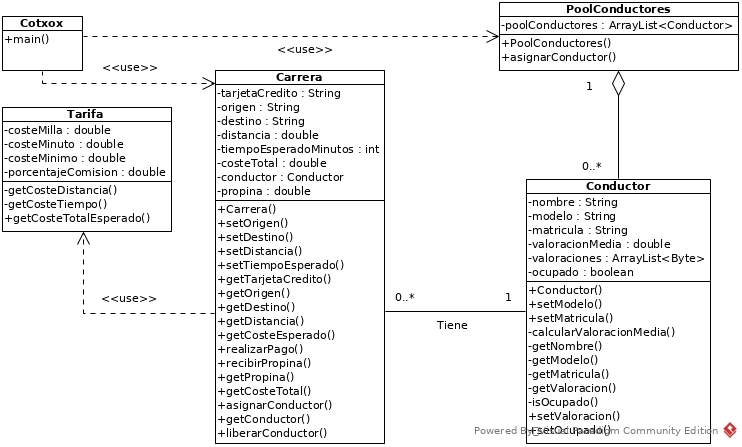

# Examen Cotxox

El examen trata de dar funcionalidad escribiendo la lógica a una aplicación de gestión de conductores para poder transportar turistas.

# Diagrama de clases

## Historias de usuario

Historia de usuario | Rol | Objetivo | Porque
--- | --- | --- | ---
1 | Turista o pasajero | Pedir un coche | Para poder desplazarse a algún lado
2 | Turista o pasajero | Ver presupuesto del viaje | Para poder saber por adelantado el coste
3 | Conductor | Llegar en poco tiempo al punto de encuentro | para no tener que hacer esperar al turista
4 | Turista o pasajero | Pagar desde la aplicación | Para hacer el pago más cómodo y rápido
5 | Turista o pasajero | Calificar al conductor con estrellas | Para que la aplicación recomiende al conductor